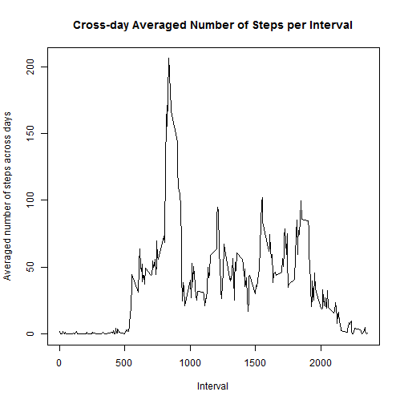

Reproducible Research - Assignment 1 
====================================
Activity data analysis
----------------------

This assignment makes use of data from a personal activity monitoring device. This device collects data at 5 minute intervals through out the day. The data consists of two months of data from an anonymous individual collected during the months of October and November, 2012 and include the number of steps taken in 5 minute intervals each day.

I will answer some questions about these data:

1 What is mean total number of steps taken per day  
  * How does the histogram of the total number of steps taken each day looks like  
  * What are the mean and median total number of steps taken per day   
  
2 What is the average daily activity pattern  
  * Make a time series plot (i.e. type = "l") of the 5-minute interval (x-axis) and       the average number of steps taken, averaged across all days (y-axis)
  * Which 5-minute interval, on average across all the days in the dataset, contains the maximum number of steps?  
  
3 Missing values  
  * Total number of missing values in the dataset 
  * Strategy for filling in all of the missing values in the dataset   
  * Create a new dataset that is equal to the original dataset but with the missing data filled in  
  * Histogram of the total number of steps taken each day and Calculate and report the mean and median total number of steps taken per day. Do these values differ from the estimates from the first part of the assignment? What is the impact of imputing missing data on the estimates of the total daily number of steps?
  
4 Are there differences in activity patterns between weekdays and weekends?

  * Create a new factor variable in the dataset with two levels - "weekday" and "weekend" indicating whether a given date is a weekday or weekend day.  
  * Make a panel plot containing a time series plot (i.e. type = "l") of the 5-minute interval (x-axis) and the average number of steps taken, averaged across all weekday days or weekend days (y-axis). The plot should look something like the following, which was creating using simulated data:

#### Downloading, unziping and reading the file:


```r
dir.create("data", showWarnings = FALSE)
url = "http://d396qusza40orc.cloudfront.net/repdata%2Fdata%2Factivity.zip"
zipfile = "data/activitymonitoringdata.zip"
download.file(url,destfile= zipfile)
unzip(zipfile, exdir="data")

activity = read.csv("data/activity.csv")
dim(activity)
```

```
## [1] 17568     3
```

```r
str(activity)
```

```
## 'data.frame':	17568 obs. of  3 variables:
##  $ steps   : int  NA NA NA NA NA NA NA NA NA NA ...
##  $ date    : Factor w/ 61 levels "2012-10-01","2012-10-02",..: 1 1 1 1 1 1 1 1 1 1 ...
##  $ interval: int  0 5 10 15 20 25 30 35 40 45 ...
```

```r
summary(activity)
```

```
##      steps               date          interval   
##  Min.   :  0.0   2012-10-01:  288   Min.   :   0  
##  1st Qu.:  0.0   2012-10-02:  288   1st Qu.: 589  
##  Median :  0.0   2012-10-03:  288   Median :1178  
##  Mean   : 37.4   2012-10-04:  288   Mean   :1178  
##  3rd Qu.: 12.0   2012-10-05:  288   3rd Qu.:1766  
##  Max.   :806.0   2012-10-06:  288   Max.   :2355  
##  NA's   :2304    (Other)   :15840
```
## 1 What is mean total number of steps taken per day?


#### Make a histogram of the total number of steps taken each day

There have been several interpretations of this point. Mine follows:

Clearly, an histogram is asked for, so it ask for frequencies of occurrence of a given data. Which one? "total number of steps taken each day". So I decided to calculate the "total number of steps taken each day" and plot an histogram of it.

In order to show the most information I decided to break it into 61 bins, one for each day.  

And also in the same plot:

#### Calculate and report the mean and median total number of steps taken per day


```r
stepstotal  = tapply(activity$steps, activity$date, sum )
hist(stepstotal, breaks=61,xlab="Total number of steps", ylab="Freq. (# of days with a given total # of steps)",main= "Histogram of total steps ")
mu= mean(stepstotal, na.rm=TRUE)
med = median(stepstotal , na.rm=TRUE)
abline(v=mu, col="blue")
abline(v=med, col="red")
```

 

Note: There큦 only one vertical red line because both values (mean and median) are very close.

Total number of steps' Mean is:

```r
mu
```

```
## [1] 10766
```
Total number of steps' Median is:

```r
med
```

```
## [1] 10765
```

Just checking (and  helping in the plot interpretation), How many days with more than 20k steps?

```r
sum(stepstotal>20000, na.rm=TRUE)
```

```
## [1] 2
```
Exactly the 2 bars on the right (with a height of 1 each).


## 2 What is the average daily activity pattern?

#### Time series plot (i.e. type = "l") of the 5-minute interval (x-axis) and  the average number of steps taken, averaged across all days (y-axis)


```r
interval = tapply(activity$steps, activity$interval, mean, na.rm=TRUE)
plot(interval ~ unique(activity$interval) , type="l",ylab="Averaged number of steps across days", xlab="Interval", main="Cross-day Averaged Number of Steps per Interval")
```

 


#### Which 5-minute interval, on average across all the days in the dataset, contains the maximum number of steps?  
The interval with the maximum averaged number of steps and its mean number of steps are:

```r
interval[which.max(interval)]
```

```
##   835 
## 206.2
```


## 3 Missing values  

#### Total number of missing values in the dataset 
The total number of Na큦 are:

```r
sum( is.na(activity$steps))
```

```
## [1] 2304
```

#### Strategy for filling in all of the missing values in the dataset   

I will assign the mean number of steps in the same interval across days to the intervals with missing values.
It's a simplistic strategy as It implies the assumption of an homogeneous distribution of steps across days.


#### Create a new dataset that is equal to the original dataset but with the missing data filled in  


```r
interval.mean = tapply(activity$steps, activity$interval, mean, na.rm=TRUE)
dfinterval = data.frame(interval=names(interval.mean), mean=interval.mean)
complete = merge(activity, dfinterval, by="interval" )
missing = is.na(complete$steps)
complete[missing,]$steps = complete[missing,]$mean
```
If  I check now the number of missing values like I did before, but with the complete dataset:

```r
sum(is.na(complete$steps))
```

```
## [1] 0
```

#### Histogram of the total number of steps taken each day and Calculate and report the mean and median total number of steps taken per day. 


```r
complete.total  = tapply(complete$steps, complete$date, sum )


hist(complete.total, breaks=61,xlab="Total number of steps", ylab="Freq. (# of days with a given total # of steps)",main= "Histogram of total steps ")
mu= mean(complete.total, na.rm=TRUE)
med = median(complete.total , na.rm=TRUE)
abline(v=mu, col="blue")
abline(v=med, col="red")
```

 

```r
mu
```

```
## [1] 10766
```

```r
med
```

```
## [1] 10766
```

#### Do these values differ from the estimates from the first part of the assignment? 
The previous values for mean and median were mean= 10766 and median=10765, now they are both 10766 
So, there has been no significant changes. I think It큦 due to the strategy choosen  for filling the missing values: The mean of a set of numbers will not change by adding more samples with a value equal to the mean. 
The median did almost not changed also due to its closeness to the mean.

#### What is the impact of imputing missing data on the estimates of the total daily number of steps?

Lets repeat  both histograms (with and without NA큦) and show them together: 
  

```r
par(mfrow=c(1,2))
hist(stepstotal, breaks=61,xlab="Total number of steps", ylab="Freq. (# of days with a given total # of steps)",main= "Histogram of total steps (with NA큦) ")
mu= mean(stepstotal, na.rm=TRUE)
abline(v=mu, col="blue")
hist(complete.total, breaks=61,xlab="Total number of steps", ylab="Freq. (# of days with a given total # of steps)",main= "Histogram of total steps (without NA큦) ")
mu= mean(complete.total, na.rm=TRUE)
abline(v=mu, col="blue")
```

 

By comparing both histograms we can see that the imputation of more steps with the mean value, has increased the number of days with a total number of steps previosly close to the mean. 
The  histogram with the complete dataset (on the right) only differs in the central bins, which have higher y-axis values. (Please, notice the diferent scale of y-axis) 


##  4 Are there differences in activity patterns between weekdays and weekends?

#### Create a new factor variable in the dataset with two levels - "weekday" and "weekend" indicating whether a given date is a weekday or weekend day.  

Imputing the mean value to NA큦 in both weekends and weekdays will soften possible differences.
So, I will use the original dataset to avoid bias from the imputed values. 


```r
weekend <- c("Saturday", "Sunday")
activity$daytype <- ifelse(weekdays(as.Date(activity$date)) %in% weekend,"weekend", "weekday")
activity$daytype = as.factor(activity$daytype)
str(activity$daytype)
```

```
##  Factor w/ 2 levels "weekday","weekend": 1 1 1 1 1 1 1 1 1 1 ...
```

#### Make a panel plot containing a time series plot (i.e. type = "l") of the 5-minute interval (x-axis) and the average number of steps taken, averaged across all weekday days or weekend days (y-axis).


```r
stepsPerInterval = aggregate(steps ~ interval * daytype, data = activity,FUN = mean)

xyplot(steps ~ interval | daytype, data=stepsPerInterval,  type="l", xlab="Interval", ylab="Number of Steps",layout = c(1,2))
```

 

In this plot we can see a higher peek of activity early in the morning in weekdays as well as less activity during typical working hours compared with weekends.

